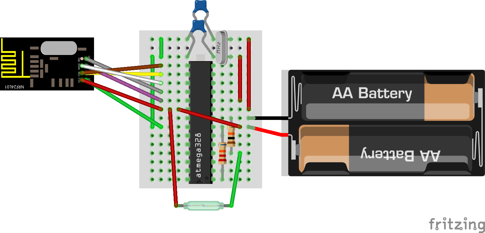

# toilet-bot
Toilet bot is a system of Arduino sensors that report bathroom stall availability to a Raspberry Pi. This information is then posted to Slack.

## Sensor setup
### Hardware
The Arduino sensors are fairly simple and consist of three components:
  - an Arduino (built on a [breadboard](https://www.virtuabotix.com/product-bareduino328-barebones-microcontroller-guide/) for battery efficiency)
  - a [magnetic switch](http://www.amazon.com/Directed-Electronics-8601-Magnetic-Switch/dp/B0009SUF08)
  - an [NRF24L01+](http://www.amazon.com/s/?field-keywords=nrf24l01%2B) wireless transceiver

Once you've wired everything up, it'll look something like this:


The blue object sticking out the bottom represents the magnetic switch. One of the wires attaches to the screw labeled COM and the other to the screw labeled NO (for normally open, which the door should be). The pulldown resistor connecting the 4th pin to ground should have relatively large resistance, as this will be the main source of current when the door is closed. I used a 10k resistor, but larger resistances should be ok too.

To connect the NRF24L01, the top-left pin on the atmega328 in the above diagram is pin 15, and pins increase on the left side going down. Connect the pins to the transceiver as follows:

atmega328 pin | NRF24L01+ pin
--------------|--------------
15 | CSN
16 | CE
17 | MOSI
18 | MISO
19 | SCK
20 | VCC
22 | GND

Note that atmega328 pin 21 is not used, nor is the IRQ pin on the NRF24L01. Your wiring may not look exactly like in the diagram, as different manufacturers can produce different pin layouts for the NRF24L01. The pins on mine are a mirror image of the one in the diagram, for example.

### Software
Once the device is all wired up, you'll need to install the following libraries by copying them into your Arduino installation's libraries directory:
  - [Low-Power](https://github.com/rocketscream/Low-Power)
  - [NR24](https://github.com/tmrh20/RF24/)
Next, just load [sensor.ino](sensor/sensor.ino) into the Arduino program to compile and [upload](http://www.arduino.cc/en/Tutorial/ArduinoToBreadboard) it onto the chip. Once the code is loaded, check the serial monitor to see if it displays reasonable-looking setup information for the transciever.

Once the hardware and software are setup, attach the magnet sensor to the bathroom door such that it closes the circuit only when the door is closed. Note that this sensor only works if the door is normally open when not occupied. You may need to modify the bathroom door if this is not the case. Try to attach these near the top of the door if possible so that your antenna can be placed as high as possible. If you have a metal stall, you'll want to place the antenna so that the stall doors and wall don't block its path to the receiver on the Raspberry Pi.

You can attach the sensors by removing the paper covering their stickers once you are sure you're found a good placement for them. You can add an LED (with appropriate resistor) to the circuit to verify placement. It should only light up when you close the door. You may be tempted to attach the breadboard using the sticker already on its back. I caution against this as it makes reprogramming, rewiring and replacing parts difficult. Instead, use [removable wall stickers](http://www.amazon.com/Command-Medium-Mounting-Refill-9-Strip/dp/B0014CQGW4). You'll want these for the battery case anyway. You may also need to tape the antenna in place to ensure good positioning. Any tape will do for that.

This setup should work with arbitrary many sensors, but at some point the channel will become overloaded. I've only tried it with 2 sensors so far.


## Receiver setup

The receiver consists of
  - A Raspberry Pi (I got a [kit](http://www.amazon.com/CanaKit-Raspberry-Complete-Original-Preloaded/dp/B008XVAVAW) with a case since I put mine in a public place)
  - USB WiFi adapter (comes in the kit)
  - an [NRF24L01+](http://www.amazon.com/s/?field-keywords=nrf24l01%2B) wireless transceiver
  - (optional) red and green LEDs, resistors, diodes, wires, breadboard for indicator lights

Diagram for attaching the NRF24L01+ to the right pins coming soon.

The software for the receiver has several requirements:
  - [enable SPI](https://www.raspberrypi.org/documentation/hardware/raspberrypi/spi/#overview) on your Raspberry Pi
  - run `sudo apt-get install python-dev python-rpi.gpio`
  - run `pip install receiver/requirements.txt`
  - copy [lib_nrf24.py](https://github.com/BLavery/lib_nrf24/blob/master/lib_nrf24.py) to the receiver directory or put it on your python path

The above will allow your code to run. Now you need to add your slack credentials to `receiver/slack_conf.yaml` with a format like
```yaml
api_token: XXXXXXXXXX
channel: YYYYYYYYYY
```
Note that channel must be the api key for a channel and not its raw text name. The bot will change the topic of the channel to reflect bathroom availability. If you don't want this behavior, you'll have to modify the code to get rid of it. You'll also have to either set up a sql table bathroom.availability or disable the sql part of the code. The sql code assumes you have a user bathroom with a password bathroom_bot. By writing to a database, you're greatly increasing the display options. You can easily host a simple PHP status page on your Raspberry Pi as an alternative to Slack posts.

Finally, you may have to modify the code to handle how many stall sensors you have. Right now, it's hard-coded for 2 sensors. This is reflected in both the message array length and the chat_msg function. Everything else should be sufficiently general to handle more bots as necessary.

If you included the optional indicator lights, you can hook them up to pins 14 and 15. This will give you a physical display indicating the current state of the bathroom doors.
